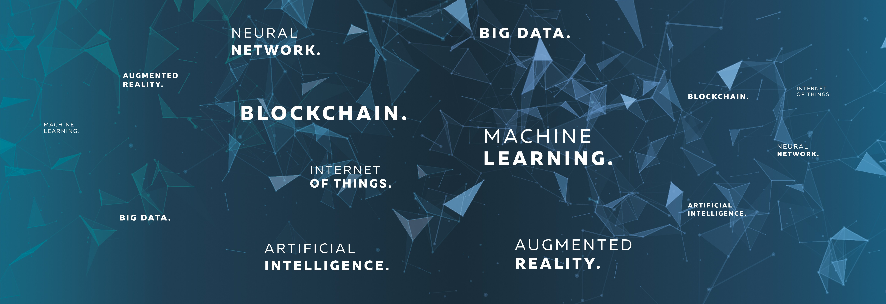

<!-- ============================= -->
<!--          BANNER SECTION       -->
<!-- ============================= -->

  

<!-- ============================= -->
<!--      TYPING SVG ANIMATION     -->
<!-- ============================= -->

  

  
  &nbsp;
  
  &nbsp;
  
  &nbsp;
  

---

<!-- ============================= -->
<!--          INTRODUCTION         -->
<!-- ============================= -->

# 👨‍💻 Vedant Gokhe  
**Designing and shipping production-grade GenAI systems, Multi-Agent RAG architectures, and scalable Data Pipelines.**

---

<!-- ============================= -->
<!--             ABOUT ME          -->
<!-- ============================= -->

## About Me  

I am an **AI Engineer, Data Engineer & Generative AI specialist** pursuing my **M.Sc. in Data Science at IIIT Lucknow ('26)**. I specialize in taking cutting-edge language models from research to production — architecting autonomous multi-agent workflows with LangGraph, fine-tuning domain-specific LLMs with QLoRA, and engineering robust streaming ETL and data lakehouse pipelines that feed high-signal context into AI systems.

With 1+ year of hands-on industry internship experience across **Ambitio**, **Ooumph**, and **Artizence**, I have engineered data monitoring platforms spanning 200k+ profiles, designed autonomous Claude Code & Bedrock agents, and trained domain-specialized LLMs. I care about building GenAI systems that are accurate, low-latency, and backed by solid data infrastructure.

### 🚀 What I Focus On:
- 🧠 **Autonomous Multi-Agent & RAG Architectures:** Architecting deterministic, multi-turn agent loops with LangGraph and Claude Code. Implementing hybrid model routing (leveraging low-latency inference like Groq Llama-3 paired with deep reasoning engines like Gemini Pro) and multi-stage RAG incorporating dense vector search (FAISS) and cross-encoder rerankers to eliminate hallucinations.
- ⚡ **Domain LLM Fine-Tuning:** Parameter-efficient instruction tuning (QLoRA, Unsloth) on open foundation models (Qwen2.5, LLaMA models). Specializing in domain classification, risk scoring, and strict schema compliance to ensure LLMs output production-ready JSON.
- 🛠️ **Data Engineering for AI:** Engineering event-driven streaming pipelines (Apache Kafka, AWS Glue, Athena) and structured data ingestion systems that ensure clean, low-latency data pipelines for LLM context and model training.

🎓 **Education:** M.Sc. Data Science @ IIIT Lucknow (CGPA: 8.20/10) | B.Sc. Mathematics  
📍 **Location:** Lucknow, Uttar Pradesh / Nagpur, Maharashtra  
📬 **Get in touch:** [vedantgokheofficial@gmail.com](mailto:vedantgokheofficial@gmail.com)

---

<!-- ============================= -->
<!--         TECH & TOOLS          -->
<!-- ============================= -->

## Tech & Tools  

  <!-- GenAI & LLMs -->
  
  
  
  
  
   
  <!-- Data Engineering & Big Data -->
  
  
  
  
  
   
  <!-- Cloud & DevOps -->
  
  
  
  

---

<!-- ============================= -->
<!--           MY PROJECTS         -->
<!-- ============================= -->

<h2>📘 Featured Projects</h2>

 

<!-- Quick Navigation Cards Grid -->
<table align="center" width="100%">
  <tr>
    <td width="33%" valign="top">
      <h3 align="center">🤖 <a href="https://github.com/VedantGokhe">Continuous-RAG</a></h3>
      
<i>Autonomous Policy Intelligence</i>

      
Multi-agent RAG with LangGraph routing, FAISS dense retrieval, BM25 & cross-encoder reranking.

      

        
        
      

    </td>
    <td width="33%" valign="top">
      <h3 align="center">⚖️ <a href="https://github.com/VedantGokhe/legal-clause-llm">Legal Clause LLM</a></h3>
      
<i>Domain Fine-Tuned 3B LLM</i>

      
Unified NLU+NLG pipeline on CUAD: 41 clause classification, 100% risk calibration & plain-English rewrites.

      

        
        
      

    </td>
    <td width="33%" valign="top">
      <h3 align="center">🌊 <a href="https://github.com/VedantGokhe">StreamLake</a></h3>
      
<i>Real-Time Data Lakehouse</i>

      
End-to-end streaming data pipeline ingesting live market feeds into Parquet lakehouse via Glue & Athena.

      

        
        
      

    </td>
  </tr>
</table>

 

### [1. Continuous-RAG — Enterprise Policy Intelligence System](https://github.com/VedantGokhe)  
*Multi-agent RAG system using LangGraph, hybrid LLM routing, and continuous document ingestion.*

**Features:**  
- **Agentic LangGraph Routing:** Orchestrates hybrid models (Groq Llama-3 for ultra-fast generation + Gemini Pro for deep reasoning) delivering definitive `ALLOWED`, `DENIED`, or `CONDITIONAL` verdicts.  
- **3-Stage Retrieval Pipeline:** Combines BM25 keyword boosting, FAISS dense vector search, and Cross-Encoder reranking for pinpoint context relevance.  
- **Hash-Based Incremental Indexing:** Detects and indexes updated PDFs without triggering full re-index overhead.  
- **Automated LLM Evaluation:** Employs Gemini Pro as a synthetic judge, scoring 83% overall on industry benchmark datasets.  

🔗 **Tech Stack:** `Python` • `LangGraph` • `FastAPI` • `FAISS` • `Groq` • `Cross-Encoder` • `React`

---

### [2. Legal Contract Clause Analyzer (NLU + NLG Fine-Tuned LLM)](https://github.com/VedantGokhe/legal-clause-llm)  
*Fine-tuned 3B LLM specialized on CUAD (41 clause categories) for classification, risk scoring, and text simplification.*

**Features:**  
- **Unified NLU + NLG Pipeline:** Executes multi-label clause classification, span extraction, risk scoring (`HIGH`/`MEDIUM`/`LOW`), and plain-English text rewriting in a single forward pass (< 2s latency).  
- **100% Risk Calibration:** Boosted risk assessment accuracy from **0% → 100%** over the base Qwen2.5-3B model on benchmark clauses (eliminating dangerous false `MEDIUM` ratings).  
- **QLoRA & Unsloth Optimization:** Parameter-efficient fine-tuning on 16,270 instruction-tuning pairs with 4-bit quantization, consuming < 4.2 GB VRAM on a free T4 GPU.  
- **Production Schema Adherence:** Strictly outputs validated, parseable JSON conforming to downstream legal API requirements.  

🔗 [GitHub Repository](https://github.com/VedantGokhe/legal-clause-llm) | [Hugging Face Model Adapter](https://huggingface.co/Vedant0824/legal-contract-clause-analyzer)  
**Tech Stack:** `Qwen2.5-3B` • `QLoRA` • `Unsloth` • `PyTorch` • `CUAD Dataset` • `Hugging Face`

---

### [3. StreamLake — Real-Time Stock Market Data Pipeline](https://github.com/VedantGokhe)  
*End-to-end streaming data lakehouse ingesting, transforming, and querying live financial market feeds.*

**Features:**  
- **Real-Time Event Streaming:** Ingests live financial market JSON streams using **Apache Kafka** producers and consumers.  
- **Serverless Glue ETL:** Transforms streaming records into partitioned, snappy-compressed **Parquet** format stored in Amazon S3.  
- **SQL Lakehouse Analytics:** Catalogs schemas dynamically with AWS Glue Data Catalog, enabling low-latency analytical SQL queries via **Amazon Athena**.  

🔗 **Tech Stack:** `Python` • `Apache Kafka` • `AWS Glue ETL` • `Amazon S3` • `Amazon Athena` • `Parquet` • `SQL`

---

<!-- ============================= -->
<!--           WIP PROJECTS        -->
<!-- ============================= -->

## Work in Progress  

- **Agentic Code-Review & Evaluation Sidecar** 🎯  
  *Autonomous multi-agent system providing automated PR reviews, test validation, and semantic regression tracking for GenAI codebases.*  

  **Features in development:**  
  - Static AST parsing combined with specialized LLM reviewers for security vulnerability and prompt injection checks.  
  - Automated synthetic test generation with hallucination boundary testing before model deployment.  
  - GitHub Actions CI/CD integration with automated badge updates.  

---

<!-- ============================= -->
<!--          CONNECT WITH ME      -->
<!-- ============================= -->

## Socials

  
  &nbsp;
  
  &nbsp;
  
  &nbsp;
  

---

<!-- ============================= -->
<!--           GITHUB STATS        -->
<!-- ============================= -->

## GitHub Stats  

  
  &nbsp;
  

  

